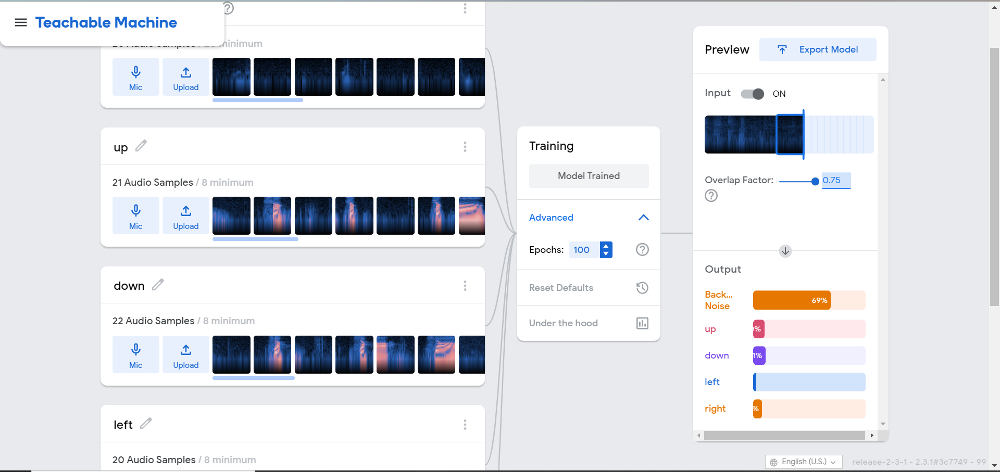

## 人工智能原理课程作业01
---
### 实验目标

- 发挥个人创作力和想象力，独立完成一个人工智能创意小应用。
- 优秀的同学可以不仅限于图像的分类，可通过Teachable Machine平台扩展应用到声音、姿态等应用。
- 了解分类神经网络的原理，并对人工智能有初步了解。
- 学有余力的同学可以尝试用python编写一些简单识别分类网络，如手写数字识别等。

---
### 项目简介
本次作业我结合 Google Teachable Machine 平台提供的AI模型，利用JavaScript编写了一个简单的贪吃蛇小游戏。

由于之前在学习JavaScript编程时，简单实现过一个[贪吃蛇小游戏](https://github.com/DinoMax00/JS-Snake/tree/master/snake-practice)，所以本次作业中想到了在之前代码的基础上加入 Google Teachable Machine提供的图像、语音分类模型来代替上下左右键控制，实现效果类似于AR体感游戏。

游戏整体沿用了寒假写的贪吃蛇游戏的界面，并用p5.js重构了控制部分代码，大概用时三四天独立完成，代码上传至[github](https://github.com/DinoMax00/JS-Snake/tree/master/AI-homework01)。

---
### 游戏方法
* 打开主目录中的index.html进入游戏界面(需要配置localhost)，或者访问已经部署好的[demo](https://dinomax00.github.io/homework01/)

使用本地打开时，可能需要改写./scripts/main.js中的以下代码，更改localhost后的端口，当然也可以使用第二行中的远程访问模型(音频识别模型路径直接使用'./my_model'会报错)。
    ```javascript
    let soundModel = 'http://localhost:63342/homework01/my_audio_model/';
    // let soundModel = 'https://teachablemachine.withgoogle.com/models/7OxN2ehlO/';
    ```

* 待左下角视频窗口加载出图像后，点击左边栏的三个选项切换游戏模式


* 三种模式分别为:

    **KeyBoard Control**:默认模式，I,K,J,L键控制上下左右。

    **Gesture Control**:根据手势控制移动，上下左右分别为

    **Audio Control**:根据语音控制移动

* 按空格键开始游戏，游戏过程中左下角窗口下方会显示当前识别的手势方向，游戏窗口上方显示当前蛇运动的方向。

* 游戏与传统贪吃蛇的区别之处为，由于AI识别灵敏度并不高，有些时候会导致蛇乱跑，所以没有设置游戏失败判定并且降低了蛇的移动速度。

* 语音模式四种声音为："上"、"下"、"左"、"右"

* 四种控制方向的手势为


  
  
  
  

* 为了提升识别效果，手势识别模式尽量不要露脸；语音识别环境音尽量安静，并且在一个方向的移动过程中可能需要重复喊方向指令来获得较好的移动效果。

---
### 模型训练

手势识别模型：


声音识别模型：


---
### 代码实现

在main.js中利用p5.js的global mode实现一个p5对象负责连接AI模型()，并用instance mode实现另一个p5对象来处理游戏逻辑。

**AI部分**其实就是把Google Teachable Machine提供的样例代码稍作改动，并把训练好的模型下载到本地调用。

部分代码：
```JavaScript
// Classifier Variable
let classifier;
let audio_classifier;
// Model URL
let imageModelURL = './my_model/';
let soundModel = 'http://localhost:63342/homework01/my_audio_model/';
// let soundModel = 'https://teachablemachine.withgoogle.com/models/7OxN2ehlO/';

// Video
let video;
let flippedVideo;
// To store the classification
let label = "";

// Load the model first
function preload() {
    classifier = ml5.imageClassifier(imageModelURL + 'model.json');
    audio_classifier = ml5.soundClassifier(soundModel + 'model.json');
}

function setup() {
    frameRate(100);
    let myWindow = createCanvas(videoWidth, videoHeight);
    myWindow.parent("aiWindow");
    // 图像检测
    video = createCapture(VIDEO);
    video.size(videoWidth, videoHeight);
    video.hide();

    flippedVideo = ml5.flipImage(video);

    // 图像检测
    classifyVideo();
    // 声音检测
    audio_classifier.classify(audio_gotResult);
}

```
**游戏逻辑部分**主要是解决两个问题：
① 手势识别模式中，AI模型会时刻对画面进行采样，并返回一个方向值，但识别出的方向并不是每次都准确，所以可能会造成蛇乱跑的问题。

我采用的解决方法是，只使用识别可信度大于0.8的画面，以20次画面识别为一组，每次选择这20次中被识别最多次的方向作为蛇的移动方向，这样只要模型识别的准确率不是太低，就能得到正确的方向。

```JavaScript
// 更新方向计数
function countDirection(direct){
    if(controlMode!=="gesture")
        return;
    switch(direct){
        case "up":
            upNum++;
            break;
        case "down":
            downNum++;
            break;
        case "left":
            leftNum++;
            break;
        case "right":
            rightNum++;
            break;
    }
    dirCnt++;
}

function updDirection(){
    if(dirCnt<sampleTime) return;
    if(upNum>max(downNum, max(leftNum, rightNum))) direction = "up";
    else if(downNum>max(upNum, max(leftNum, rightNum))) direction = "down";
    else if(leftNum>max(downNum, max(upNum, rightNum))) direction = "left";
    else if(rightNum>max(downNum, max(leftNum, upNum))) direction = "right";
    // 计数器清零
    dirCnt = upNum = downNum = leftNum = rightNum = 0;
}
```
②对不同的控制模式进行区分

只需要维护一个全局变量controlMode来记录当前模式，每中控制模式的相应函数在改变方向时都检测一下controlMode的值是否符合要求。

---
### 有待解决的问题

- 最大的问题还是在识别的准确度上，手势识别中每种手势都提供了接近两千张照片，包含我和其余两个同学的手势。虽然最终训练结果对我的手势识别已经非常准确，但其他同学的测试效果依然很差，甚至不同的衣服作为背景也会很大的影响识别效果。原因应该是训练集的设置不合理，使得训练出的模型无法对不同人的手型等因素进行识别。但是当尝试继续扩大训练集后，网页端的teachablemachine会出现卡顿崩溃等问题，希望在之后课上学习到其他的AI算法后可以继续优化我的模型。

- 语音模型上的问题在于识别模型采样比较慢，导致反应会有延迟，并不是很灵敏。

- 为了避免助教和老师运行项目的识别效果不好，所以配备了简单的演示视频。
