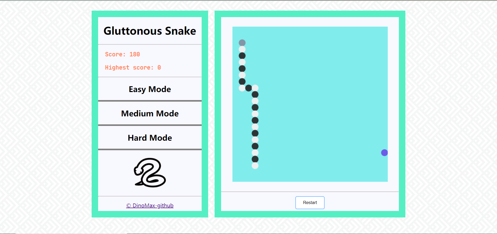
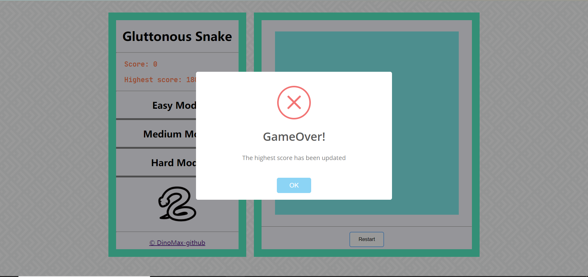
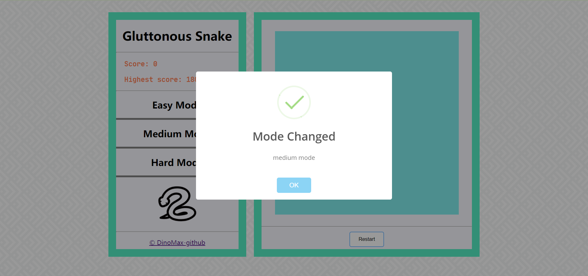

# **JS-Snake**

Javascript练手项目，[**贪吃蛇**](https://dinomax00.github.io/snake/snake.html)  🐍

---
### **简介**：
花费大概三四天完成这个项目，边写边学，虽然最后做出来还是很简陋 😅

空格建开始或暂停游戏，上下左右键控制移动，左侧有三种难度选项，下方restart按钮重新开始游戏。当蛇头撞向身体时游戏结束，由于地图比较小，没有设置边缘碰撞检测，蛇头撞向边缘时会从另一边穿出。

---
### **文件**
- **top.js** : 调用control模块，监听各种事件
- **snake.js** : 蛇模型，封装了蛇的初始化，移动，显示等方法
- **control.js** : 实现了一个Control类，负责对游戏的整体控制，包括屏幕初始化，处理各种按键，实例化蛇模型，食物模型，游戏成功或失败的判断等
- **lib.js** : 实现了Node类，蛇身体的每个节点还有食物模型都是实例化这个类
- **food.js** : 实现Food类，继承Node，增加了食物坐标的生成的方法
- **config.js** : 游戏的各项基本参数
- **sweetalert-dev.js** : 网上找的，提示框美化
- **jquery.js** : 不多解释👍
---
### **游戏截图**

